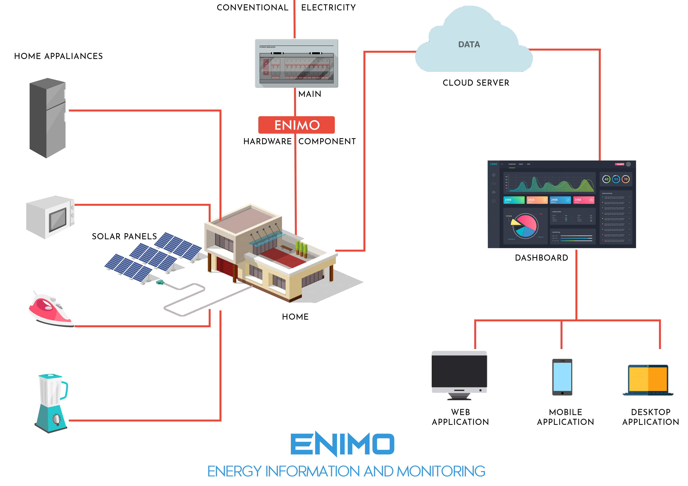

## Introduction  to Enimo

### Description

The World is in a transition phase and energy is central to it. India has been responsible for almost 10% of the increase in global energy demand since 2000 pushing the country’s share in global demand up to **5.7%** in 2013 from **4.4%** at the beginning of the century. The primary energy demand in India has grown from about **441 Mtoe** (Million tonne of oil equivalent) in 2000 to about **775 Mtoe** in 2013. This demand is expected to increase to about **1250** (estimated by International Energy Agency) to **1500** (estimated in the Integrated Energy Policy Report) million toe in 2030. One of the biggest problems faced in India today is the challenge caused by increased energy consumption due to the over population.


### Problem Statement:


In today’s era, Households occupy a major percentage of electrical energy. With the increase in the population, the requirement of the electricity keeps on increasing. So there is a constant need for a system which helps in decreasing the consumption of electricity and find the energy wastage in the household. Industries usually have monthly energy audits. However, the households don't have the energy audits.


### Benefits of having an Energy Monitoring System(ENIMO):


•    Reduces cost by analyzing the amount of data required and the amount of energy being consumed. The  Dashboard provides the information and recommendation model which gives necessary tips observing the patterns.

•    24/7 alarm notifications allow you or your Family to respond quickly to appliance issues.

•    Save time by having remote access to appliance data and pinpointing faults in the specific individual appliances.


## Solution:
Energy consumption monitoring of equipment in Households in real time. Displaying the real-time insights on the dashboard. Generating prediction using the collected data by data analysis and machine learning algorithms to empower decision making.

ENIMO(Energy Information and Monitoring)is the answer to all these problems.

Enimo has two main objectives to complete and they are:

•    Identify faults and weaknesses in the equipment early so preventative maintenance and replacement can be done in a safe and orderly way

•    Ensuring that the appliance is maintained at an optimum environment to maximize performance and life.

### Flow Diagram: 



## Technology Stack
The Enimo is purely built in **ReactJS** with some other dependencies which are given below: 

### Front-End Stack: 
1. **Redux** is used to handle the different states in the project. 
2. **ChartJS, ReCharts** are for handling the data provided and visualize them.
3. **React-Router** is used to switch from one link to another link.
4. **ParticleJS** for making the UI More attractive.
5. **FontAwesomeIcons, Weather Icons, LinearIcons** are the different types of icons used in the project.
6. **SCSS**: Instead of the normal CSS, we have used **SCSS** which be very useful in changing the color of the dashboard. 
7. **Bootstrap, Reactstrap**: For making the whole project responsive to the screen size of the device.
### Different API's:
1. **Solcast API**: This API tells the amount of solar energy which can be generated on a  sunny day. The estimated solar energy  is compared with the actual solar energy  produced by the households.

2. **OpenWeatherMap API**: This API fetches the weather for the given current location.

3. **Axios Library**: We have used the Axios library to fetch the data from all of the API's

4. **ElectronJS**: The ElectronJs was used to create cross-platform desktop applications. 
### Back-End Stack:
1. **NoSQL Database**: We have used the cloud firestore as the database for the project. It can be easily configured and fetches the data very fast. 

2. **Cloud**: As all the data from the **hardware component** is sent to the cloud, as all the data analysis algorithms are present in the cloud. The insights from these algorithm's are then sent to the database for displaying the data in dashboard.

3. **scikit-learn**: We have used scikitlearn to perform the analysis and get predictions
 ## Installation
Use the package manager [yarn](https://yarnpkg.com/lang/en/docs/install/#windows-stable) to install the yarn in your system.

After **cloning the repo** to your system, change the **directory of the command prompt** to the repo.

### 1. Yarn Install:
The **yarn install** command is used to install all the different dependencies which are present in the project.
```bash
yarn install
```

### 2. Yarn Start:
The **yarn start** command is used to start the project after installing all the dependencies.
```bash
yarn start
```
 Open **http://localhost:3000** to view it in the browser.
 
## Word Document: 
The documentation for the project is available [here](other/docs/EnimoDocument.docx) 

## Presentation:
The presentation of the project is [here](other/docs/EnimoPresentation.pptx)

## Video:
The explanation of the project is briefly done in this [Video](https://youtu.be/_r7YCbJWhaY)
## Demo:
You can see the demo of the project at [Enimo](http://enimo.ezerka.in) and make sure to adjust the zoom of the browser

## Learn More About React Below

You can learn more in the [Create React App documentation](https://facebook.github.io/create-react-app/docs/getting-started).

To learn React, check out the [React documentation](https://reactjs.org/).

### Code Splitting

This section has moved here: https://facebook.github.io/create-react-app/docs/code-splitting

### Analyzing the Bundle Size

This section has moved here: https://facebook.github.io/create-react-app/docs/analyzing-the-bundle-size

### Making a Progressive Web App

This section has moved here: https://facebook.github.io/create-react-app/docs/making-a-progressive-web-app

### Advanced Configuration

This section has moved here: https://facebook.github.io/create-react-app/docs/advanced-configuration

### Deployment

This section has moved here: https://facebook.github.io/create-react-app/docs/deployment

### All Contributors
